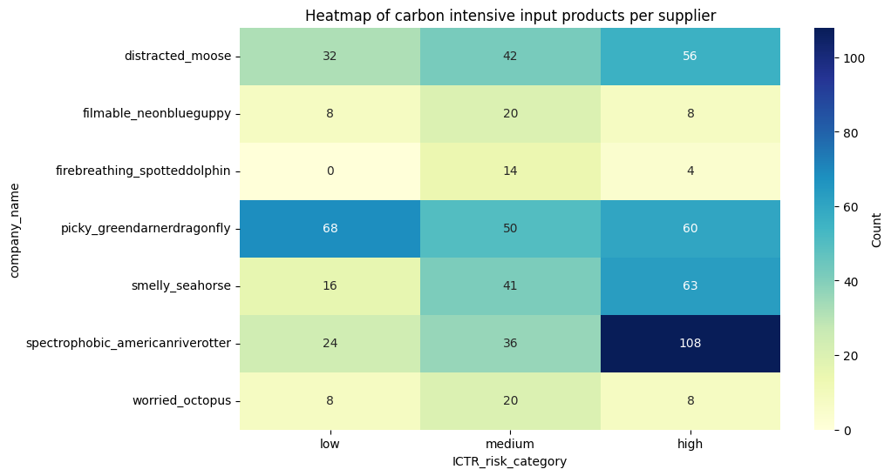

# Supply chain analysis based on input data.
## Overview 
The tilt methodology can also be applied to the supply chain of a company, to better understand the supply chain-related climate impact and risks. For applying the indicators to suppliers, the following approach is used in our Supply Chain Risk Model:

## Dataset

The dataset used in this analysis is stored in a CSV file named `emissions_profile_upstream_at_product_level_with_fake_names.csv`. The CSV file contains the following columns:
- `company_name`: The name of the company.
- `ICTR_risk_category`: The risk category, which can be 'low', 'medium', or 'high'.
- `country`: The country where the product is sourced.

## Requirements

To run the code, you need to have the following Python libraries installed:
- pandas
- seaborn
- matplotlib

You can install these libraries using pip:
```bash
pip install pandas seaborn matplotlib
```

## Usage

1. **Load the Dataset**: The code reads the data from the CSV file into a pandas DataFrame.
   ```python
   emissions_profile_upstream_product = pd.read_csv('emissions_profile_upstream_at_product_level_with_fake_names.csv')
   ```

2. **Data Preparation**: The relevant columns (`company_name`, `ICTR_risk_category`, and `country`) are selected from the DataFrame.
   ```python
   df = emissions_profile_upstream_product[['company_name', 'ICTR_risk_category', 'country']]
   ```

3. **Pivot Table Creation**: A pivot table is created to count the number of products in each ICTR risk category for each company.
   ```python
   pivot_table = df.pivot_table(index='company_name', columns='ICTR_risk_category', values='country', aggfunc='count', fill_value=0)
   ```

4. **Ordering of Columns**: The columns of the pivot table are ordered to ensure 'low', 'medium', and 'high' appear in the correct order.
   ```python
   order = ['low', 'medium', 'high']
   pivot_table = pivot_table[order]
   ```

5. **Heatmap Visualization**: A heatmap is created using seaborn to visualize the count of products in each risk category for each company.
   ```python
   plt.figure(figsize=(10, 6))
   sns.heatmap(pivot_table, annot=True, fmt='d', cmap='YlGnBu', cbar_kws={'label': 'Count'})
   plt.title('Heatmap of carbon intensive input products per supplier')
   plt.show()
   ```

## Example

Here is a complete example of the code:
```python
import pandas as pd
import seaborn as sns
import matplotlib.pyplot as plt

# Load the dataset
emissions_profile_upstream_product = pd.read_csv('emissions_profile_upstream_at_product_level_with_fake_names.csv')

# Select relevant columns
df = emissions_profile_upstream_product[['company_name', 'ICTR_risk_category', 'country']]

# Create a pivot table
pivot_table = df.pivot_table(index='company_name', columns='ICTR_risk_category', values='country', aggfunc='count', fill_value=0)

# Order the columns
order = ['low', 'medium', 'high']
pivot_table = pivot_table[order]

# Create a heatmap
plt.figure(figsize=(10, 6))
sns.heatmap(pivot_table, annot=True, fmt='d', cmap='YlGnBu', cbar_kws={'label': 'Count'})
plt.title('Heatmap of carbon intensive input products per supplier')
plt.show()
```




## Contributing

Contributions are welcome! Please feel free to submit a Pull Request.

## License

This project is licensed under the MIT License. See the LICENSE file for details.

---

Happy coding! If you have any questions or need further assistance, please feel free to open an issue in this repository.